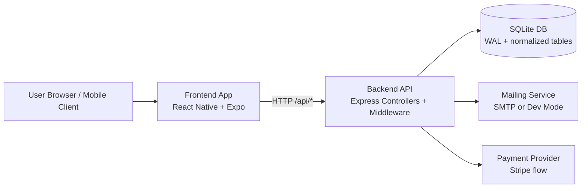
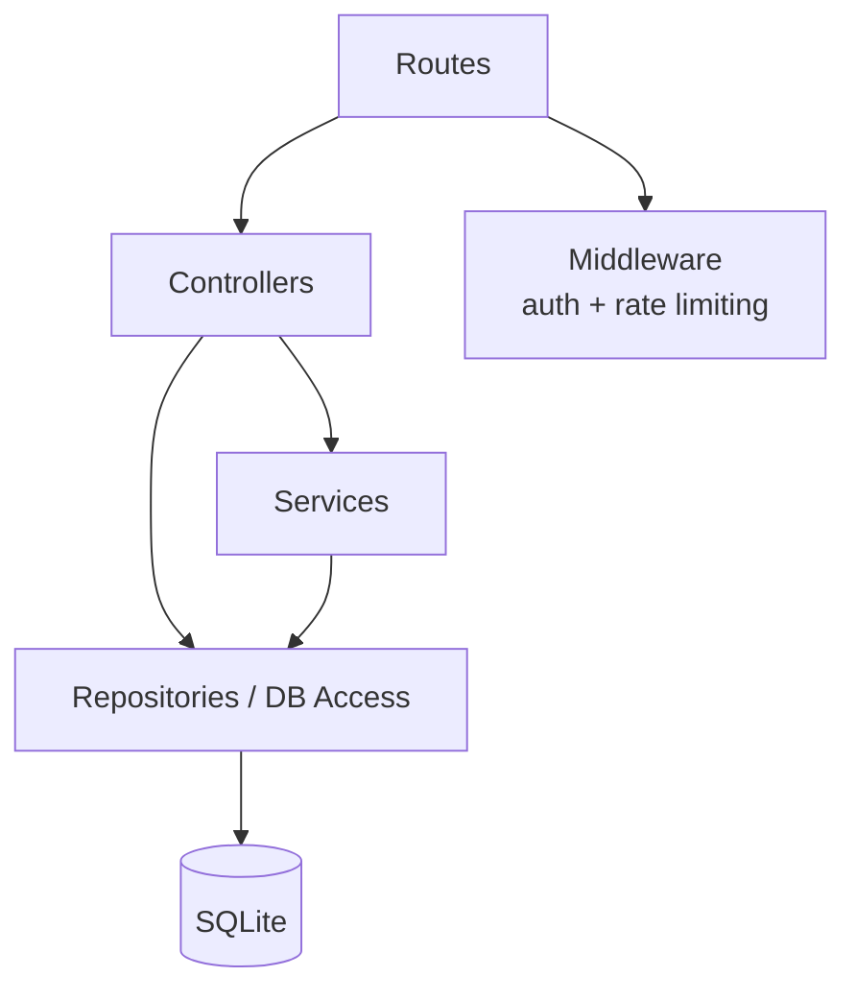
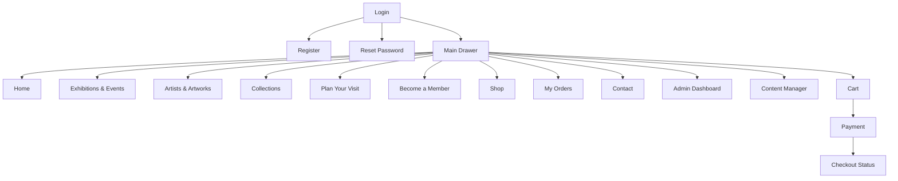
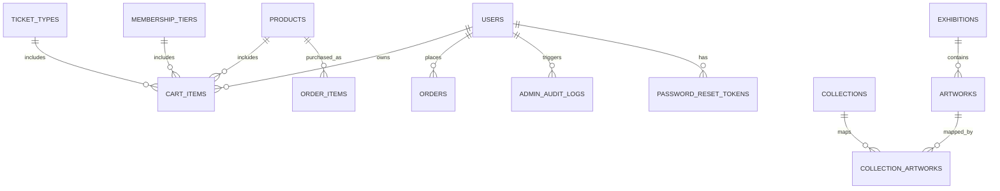

# Architecture: The Art Museum App (As Built)

This document maps the current implementation, deployment model, and all major features in the repository.

## 1. System Overview

- Frontend: React Native + Expo (web enabled)
- Backend: Node.js + Express
- Database: SQLite (better-sqlite3) with WAL mode
- Auth: JWT + bcrypt password hashing
- Payments: Stripe integration path (frontend + backend checkout flow)
- CI/CD: GitHub Actions for CI, security audits, and Pages deployment

## 2. Runtime Architecture

## 3. Backend Layer Map

### Route Domains

- Auth: login, register, me, forgot/reset password, diagnostics
- Catalogue: tickets, memberships, products, collections, exhibitions
- Cart: add/update/remove and fetch cart items
- Checkout: intents, payment/status flow
- Contact: message submission + newsletter subscription
- Admin: content and operational management endpoints

## 4. Frontend Navigation Map

## 5. Data Model Map

## 6. Feature Inventory (Complete)

### Identity and Access

- Email/password registration and login
- JWT-based session auth
- Role-aware UI behavior (user/member/admin labels and access)
- Forgot/reset password flow with token storage

### Catalogue and Discovery

- Tickets, memberships, products, collections, exhibitions APIs
- Search/filter controls on catalogue surfaces
- Artists and artworks screen with:
  - Clickable artist cards
  - Pagination controls
  - Clickable artwork detail panel

### Commerce and Checkout

- Shop product detail and image carousel
- Add-to-cart with stock-aware quantity controls
- More-in-shop clickable product switching
- Cart and order pipeline
- Stripe-oriented checkout status flow

### Contact and Communications

- Contact message submission
- Newsletter subscription
- Dev/prod mailing mode handling

### Admin and Operations

- Admin dashboard and content manager screens
- Backend admin routes and audit trail support
- Diagnostics/status endpoints for environment readiness

### Reliability and QA

- Backend test suites
- Frontend screen and interaction tests
- Demo health checks for seeded data thresholds
- CI pipeline gates for backend, frontend, config guard, and demo verification
- Security workflow for dependency review and audit baseline control

### Portfolio and Publication

- Portfolio document for recruiter-facing review
- GitHub Pages deployment from docs/ via workflow

## 7. Security Controls (Current)

- Password hashing with bcrypt
- JWT token validation on protected endpoints
- Role-based checks for admin operations
- Auth rate limiting and request guards
- Config checks for production-sensitive settings
- Security workflow for dependency scanning

## 8. Local Run Model

- Backend: http://localhost:5000
- Frontend web: http://localhost:8096

Root helper commands:

- npm run start:backend
- npm run start:frontend:web
- npm run demo:health
- npm run verify:demo

## 9. Notes for Private Repository Mode

If this repository is switched to private, CI still runs normally. GitHub Pages publication depends on account/repository plan and Pages permissions.

Recommended checks after privacy switch:

1. Settings -> General -> Change repository visibility -> Private
2. Settings -> Pages -> Source set to GitHub Actions
3. Actions tab -> verify successful run of Pages workflow
